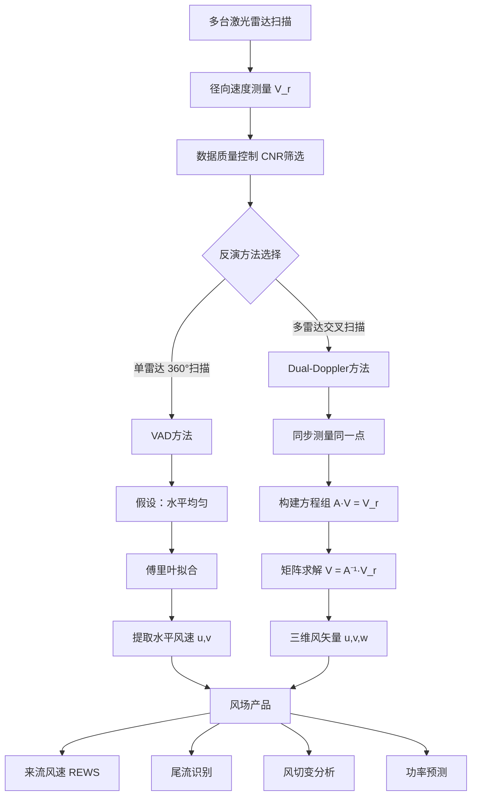
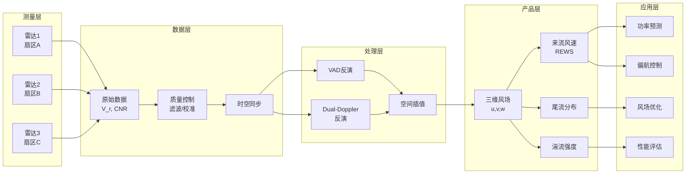

# 三维扫描雷达在风电场中的应用技术文档

**文档版本**：1.0  
**创建日期**：2026年2月  
**适用对象**：风电工程师、雷达数据分析人员、研究人员  
**文档目标**：系统梳理三维扫描雷达（激光雷达）在风电场中的应用原理、测量方法和工程价值

---

## 目录

1. [扫描几何与角度定义](#1-扫描几何与角度定义)
2. [雷达测量原理](#2-雷达测量原理)
3. [三维风场反演原理](#3-三维风场反演原理)
4. [来流风速构建方法](#4-来流风速构建方法)
5. [内部风场与尾流问题](#5-内部风场与尾流问题)
6. [多雷达系统的工程价值](#6-多雷达系统的工程价值)
7. [示意图](#7-示意图)

---

## 1. 扫描几何与角度定义

### 1.1 方位角（Azimuth）

#### 定义
**方位角**是激光束在水平面内的指向角度，用于描述雷达扫描的水平方向。

- **参考基准**：正北方向为 0°（或 360°）
- **旋转方向**：顺时针方向增加
- **角度系统**：
  - 0° / 360° = 正北（N）
  - 90° = 正东（E）
  - 180° = 正南（S）
  - 270° = 正西（W）

#### 取值范围
- **完整扫描**：0° ~ 360°（全方位扫描，用于 PPI、VAD 模式）
- **扇区扫描**：常见于风电场定向监测
  - 例如：45° ~ 135°（东向扇区）
  - 例如：200° ~ 260°（西南向扇区）
  - 扇区宽度根据监测需求设置，通常为 10° ~ 120°

#### 风场扫描中的应用
- **全方位扫描（360°）**：
  - 用于风资源全面评估
  - VAD 算法要求（需要完整方位角覆盖）
  - 适合气象研究和风场普查
  
- **扇区扫描**：
  - 针对主导风向的重点监测
  - 提高特定方向的时间分辨率
  - 多雷达系统中各设备负责不同扇区
  - 减少扫描周期，提高数据更新率

### 1.2 仰角（Elevation）

#### 定义
**仰角**是激光束相对于水平面的俯仰角度，用于控制雷达探测的垂直维度。

- **参考基准**：水平面为 0°
- **角度方向**：
  - 正值：向上仰起（常用）
  - 负值：向下俯视（少见，地基雷达一般不使用）
- **垂直扫描**：0° ~ 90°（从水平到天顶）

#### 气象雷达中的典型范围
气象雷达仰角通常限制在 **0° ~ 30°**，原因如下：

1. **大气探测需求**：
   - 气象目标（云、降水、风场）主要分布在对流层（0 ~ 12 km）
   - 仰角过大会快速脱离目标区域

2. **水平覆盖要求**：
   - 气象预报需要大范围水平覆盾
   - 低仰角扫描能覆盖更大的水平区域

3. **探测效率**：
   - 仰角 < 15°：适合边界层和低空风场探测
   - 仰角 15° ~ 30°：适合中低层大气探测
   - 仰角 > 30°：水平覆盖范围急剧缩小，探测效率降低

#### 仰角与探测几何的关系

##### 几何关系公式

假设雷达发射距离为 R，仰角为 θ，则：

```
水平距离 = R × cos(θ)
探测高度 = R × sin(θ)
```

##### 实例计算

**示例 1：低仰角扫描（θ = 5°）**
- 斜距 R = 2000 m
- 水平距离 = 2000 × cos(5°) ≈ 1992 m
- 探测高度 = 2000 × sin(5°) ≈ 174 m

**示例 2：中仰角扫描（θ = 30°）**
- 斜距 R = 2000 m
- 水平距离 = 2000 × cos(30°) ≈ 1732 m
- 探测高度 = 2000 × sin(30°) = 1000 m

**示例 3：高仰角扫描（θ = 60°）**
- 斜距 R = 2000 m
- 水平距离 = 2000 × cos(60°) = 1000 m
- 探测高度 = 2000 × sin(60°) ≈ 1732 m

##### 仰角增大对水平覆盖的影响

| 仰角 θ | cos(θ) | 水平距离比例 | 说明 |
|--------|--------|-------------|------|
| 0° | 1.000 | 100% | 完全水平 |
| 5° | 0.996 | 99.6% | 几乎无影响 |
| 15° | 0.966 | 96.6% | 轻微下降 |
| 30° | 0.866 | 86.6% | 明显下降 |
| 45° | 0.707 | 70.7% | 显著下降 |
| 60° | 0.500 | 50% | 急剧下降 |
| 75° | 0.259 | 25.9% | 大幅下降 |
| 90° | 0 | 0% | 垂直向上，无水平覆盖 |

**关键结论**：
- 仰角 < 15°：水平覆盖损失 < 5%，适合大范围监测
- 仰角 30° ~ 45°：水平覆盖损失 15% ~ 30%，适合中高层探测
- 仰角 > 60°：水平覆盖损失 > 50%，仅适合垂直廓线测量

#### 空间扫描形成的几何形状

##### 扁平半球扇区

雷达三维扫描形成的空间结构为 **扁平半球扇区**（Flattened Hemispherical Sector）：

- **方位维度**：扇形或圆形（取决于方位角扫描范围）
- **仰角维度**：扁平（仰角通常 < 30°）
- **距离维度**：径向延伸（100 m ~ 数公里）

**几何特征**：
- 不是完整的半球体，而是贴近地面的扁平扇形空间
- 垂直高度远小于水平范围
- 形状类似"薄饼"或"盘子"

**空间体积估算**：
- 假设方位角覆盖 Δφ，仰角范围 0° ~ θ_max，距离 R_min ~ R_max
- 体积 ≈ (Δφ / 360°) × (2π/3) × (R_max³ - R_min³) × sin³(θ_max)

---

## 2. 雷达测量原理

### 2.1 多普勒雷达测量的物理量

单台多普勒雷达的 **直接测量量** 是：

**径向风速（Radial Wind Speed, RWS）**

- **物理意义**：沿激光束方向的风速分量
- **符号约定**：
  - 正值：风离开雷达（远离）
  - 负值：风接近雷达（靠近）
- **测量原理**：基于多普勒频移效应

### 2.2 为什么只能测得径向风速

#### 多普勒效应原理

1. **发射激光**：雷达发射单色激光（波长 λ）
2. **气溶胶散射**：大气中的气溶胶粒子随风运动，散射激光
3. **频移测量**：运动粒子导致回波频率发生偏移
4. **频移公式**：
   ```
   Δf = (2 × V_r) / λ
   ```
   其中：
   - Δf：多普勒频移
   - V_r：径向速度（沿激光束方向）
   - λ：激光波长

5. **径向速度反算**：
   ```
   V_r = (λ × Δf) / 2
   ```

#### 测量限制

多普勒雷达只能测量 **沿激光束方向** 的速度分量，原因：

- **一维敏感性**：激光束只对沿其传播方向的运动敏感
- **垂直分量不可见**：垂直于激光束的风速分量不产生频移
- **单一视线**：一个探测方向只能获得一个速度分量

### 2.3 径向风速与三维风矢量的数学关系

#### 风矢量表示

三维风矢量 **V** 可表示为：

```
V = (u, v, w)
```

其中：
- u：东西向风速（向东为正）
- v：南北向风速（向北为正）
- w：垂直风速（向上为正）

或使用极坐标：
```
V = (V_h, α, w)
```

其中：
- V_h = √(u² + v²)：水平风速
- α：风向角
- w：垂直风速

#### 径向速度投影公式

径向风速是风矢量在激光束方向上的投影：

```
V_r = V · r̂
```

其中：
- V_r：径向风速（标量）
- V：三维风矢量
- r̂：激光束方向的单位向量
- · 表示向量点积

#### 展开形式

假设：
- 方位角 φ
- 仰角 θ

则激光束方向单位向量为：
```
r̂ = (cos(θ)cos(φ), cos(θ)sin(φ), sin(θ))
```

径向风速的完整表达式：
```
V_r = u × cos(θ) × cos(φ) + v × cos(θ) × sin(φ) + w × sin(θ)
```

简化为：
```
V_r = V_h × cos(θ) × cos(φ - α) + w × sin(θ)
```

其中：
- V_h：水平风速
- α：水平风向
- φ：雷达方位角
- θ：雷达仰角

#### 物理意义

1. **水平分量**：V_h × cos(θ) × cos(φ - α)
   - 当雷达方位角与风向一致（φ = α）时，水平分量最大
   - 当雷达垂直于风向（φ - α = 90°）时，水平分量为零

2. **垂直分量**：w × sin(θ)
   - 仰角越大，垂直风速贡献越大
   - 水平扫描（θ = 0）时，垂直风速不可见

3. **混合测量**：
   - 径向风速是水平和垂直风速的加权组合
   - 单一测量无法区分水平和垂直分量
   - 需要多方向测量才能解算三维风矢量

---

## 3. 三维风场反演原理

### 3.1 单台雷达反演水平风的假设

#### 基本假设

单台雷达要反演水平风场，必须满足 **水平均匀性假设**：

**假设内容**：在扫描范围内，水平风场（u, v）在空间上均匀分布，不随位置变化。

**数学表达**：
```
u(x, y) = u₀ = constant
v(x, y) = v₀ = constant
```

#### 假设的合理性

**适用场景**：
- 平坦地形
- 大尺度天气系统
- 扫描范围较小（< 10 km）
- 时间窗口较短（< 10 分钟）

**不适用场景**：
- 复杂地形（山地、城市）
- 局地环流（海陆风、山谷风）
- 风场急剧变化（锋面、对流系统）
- 风电场内部（受风机尾流影响）

### 3.2 VAD 方法（Velocity Azimuth Display）

#### 原理

VAD 是利用 **方位角变化** 反演水平风的经典方法。

#### 测量配置

- **固定仰角**：通常 θ = 15° ~ 75°
- **完整方位角扫描**：φ = 0° ~ 360°
- **固定距离**：选择某一距离门（高度层）

#### 数学模型

在水平均匀假设下，径向速度随方位角的变化为：

```
V_r(φ) = V_h × cos(θ) × cos(φ - α) + w × sin(θ)
```

展开为：
```
V_r(φ) = a₀ + a₁ × cos(φ) + b₁ × sin(φ)
```

其中：
- a₀ = w × sin(θ)（垂直速度贡献）
- a₁ = u × cos(θ)
- b₁ = v × cos(θ)

#### 反演步骤

1. **数据采集**：在固定仰角和高度，采集 360° 方位角的径向速度
2. **傅里叶拟合**：对 V_r(φ) 进行正弦曲线拟合
3. **参数提取**：获得 a₀, a₁, b₁
4. **风速风向计算**：
   ```
   u = a₁ / cos(θ)
   v = b₁ / cos(θ)
   V_h = √(u² + v²)
   α = arctan(v / u)
   w = a₀ / sin(θ)
   ```

#### VAD 的优缺点

**优点**：
- 算法成熟，广泛应用
- 单台雷达即可反演
- 适合业务化运行

**缺点**：
- 需要完整 360° 扫描（扇区扫描不适用）
- 假设水平均匀性（风场复杂时误差大）
- 无法反演水平风场的空间分布

### 3.3 Dual-Doppler 反演

#### 原理

使用 **两台或多台雷达** 从不同方向同时测量同一空间点，通过几何解算获得三维风矢量。

#### 几何条件

##### 最小配置：两台雷达

**交叉角要求**：
- 理想交叉角：60° ~ 120°
- 最小交叉角：> 30°（避免解算病态）
- 最大交叉角：< 150°（避免解算病态）

**原因**：
- 交叉角太小：两个测量方向几乎平行，垂直方向误差被放大
- 交叉角太大：两个测量方向几乎对冲，平行方向误差被放大
- 最优配置：90° 正交（误差最小）

##### 方程组形式

假设两台雷达测量同一点：

**雷达 1**（方位角 φ₁，仰角 θ₁）：
```
V_r1 = u × cos(θ₁) × cos(φ₁) + v × cos(θ₁) × sin(φ₁) + w × sin(θ₁)
```

**雷达 2**（方位角 φ₂，仰角 θ₂）：
```
V_r2 = u × cos(θ₂) × cos(φ₂) + v × cos(θ₂) × sin(φ₂) + w × sin(θ₂)
```

##### 解算情况

**两台雷达（2 个方程，3 个未知数）**：
- 欠定系统，无法唯一解
- 需要额外假设（如 w = 0 或 w 已知）

**三台雷达（3 个方程，3 个未知数）**：
- 刚好定解，可唯一求解 (u, v, w)
- 最常用配置

**方程组矩阵形式**：
```
┌                                      ┐ ┌   ┐   ┌      ┐
│ cos(θ₁)cos(φ₁)  cos(θ₁)sin(φ₁)  sin(θ₁) │ │ u │   │ V_r1 │
│ cos(θ₂)cos(φ₂)  cos(θ₂)sin(φ₂)  sin(θ₂) │ │ v │ = │ V_r2 │
│ cos(θ₃)cos(φ₃)  cos(θ₃)sin(φ₃)  sin(θ₃) │ │ w │   │ V_r3 │
└                                      ┘ └   ┘   └      ┘
```

简写为：
```
A × V = V_r
```

求解：
```
V = A⁻¹ × V_r
```

其中 A 为几何矩阵，A⁻¹ 存在的条件是：det(A) ≠ 0

#### 三台雷达的理想布局

**平面布局**：
- 三台雷达围成三角形
- 每对雷达交叉角约 60° ~ 90°
- 等边三角形布局最优（每对间隔 120°）

**高度配置**：
- 可同高度，也可不同高度
- 仰角需覆盖感兴趣的高度层

#### Dual-Doppler 优势

- **不依赖均匀性假设**：可反演复杂风场
- **空间分辨率高**：逐点反演风矢量
- **三维风场重建**：获得完整的 (u, v, w) 分布

#### Dual-Doppler 挑战

- **设备成本高**：需要多台雷达
- **时空同步**：要求各雷达同步扫描
- **几何覆盖**：共同覆盖区域有限
- **数据处理复杂**：需要精确的雷达位置和指向校准

---

## 4. 来流风速构建方法

### 4.1 风电场中"来流风速"的工程定义

#### 来流风速（Inflow Wind Speed）

**定义**：进入风电场或到达风机转子平面之前的风速，未受到风机扰动的自由来流。

**工程意义**：
- 决定风机可用风能
- 影响发电功率
- 用于功率曲线验证
- 风机控制策略输入
- 风场性能评估基准

#### 与其他风速概念的区别

| 风速类型 | 测量位置 | 是否受扰动 | 应用场景 |
|---------|---------|-----------|---------|
| 来流风速 | 风机上游（无扰动区） | 否 | 资源评估、功率预测 |
| 轮毂高度风速 | 风机轮毂中心 | 可能受扰动 | 现场监测 |
| 转子等效风速 | 整个转子扫掠面积 | 否（理想） | 精确功率预测 |
| 尾流风速 | 风机下游 | 是（强扰动） | 尾流研究、排布优化 |

### 4.2 转子等效风速（REWS）

#### 定义

**转子等效风速（Rotor Equivalent Wind Speed）** 是整个转子扫掠面积上的风速加权平均，代表风机实际感受到的等效来流。

#### 为什么需要面积加权平均

**原因 1：风速空间不均匀**
- 风速随高度变化（风切变）
- 风速随水平位置变化（湍流、地形）
- 转子不同位置感受不同风速

**原因 2：功率非线性**
- 功率 ∝ 风速³
- 简单算术平均无法准确表征可用功率
- 需要考虑风速分布对功率的综合影响

**原因 3：工程实用性**
- 单点风速（如轮毂高度）不能代表整个转子
- REWS 更准确反映风机输入条件
- 用于功率曲线验证和性能评估

#### REWS 公式

**面积加权平均**：

```
U_REWS = (∫_A U(x,y) dA) / A
```

其中：
- U(x,y)：转子平面上位置 (x,y) 的风速
- A：转子扫掠面积
- dA：面积微元

**离散化形式**（实际应用）：

```
U_REWS = (Σᵢ Uᵢ × Aᵢ) / A_total
```

其中：
- Uᵢ：第 i 个网格或测量点的风速
- Aᵢ：第 i 个网格的面积权重
- A_total：总转子面积

#### REWS 计算步骤

**步骤 1：划分转子平面**
- 将转子扫掠面积划分为若干网格（如 10×10）
- 每个网格对应一个测量点或插值点

**步骤 2：获取各点风速**
- 从雷达数据中提取对应位置的风速
- 可能需要空间插值

**步骤 3：计算面积权重**
- 根据网格大小确定权重 Aᵢ
- 通常采用均匀网格（等权重）或极坐标网格

**步骤 4：加权求和**
- 计算 U_REWS = Σ(Uᵢ × wᵢ)，其中 wᵢ = Aᵢ / A_total

#### 考虑风切变的简化模型

**指数律风切变**：

```
U(z) = U_ref × (z / z_ref)^α
```

其中：
- U(z)：高度 z 处的风速
- U_ref：参考高度 z_ref 的风速
- α：风切变指数（通常 0.1 ~ 0.3）

**REWS 近似公式**（垂直积分）：

```
U_REWS ≈ U_hub × [1 + (α × (α-1) × σ²) / 6]
```

其中：
- U_hub：轮毂高度风速
- σ = D / (2 × H_hub)：转子半径与轮毂高度之比
- D：转子直径

### 4.3 从三维扫描体中提取上游来流

#### 上游定义

**上游区域**：位于风机前方、未受风机影响的区域。

**距离选择**：
- 最小距离：> 2 倍转子直径（2D）
- 推荐距离：3 ~ 5 倍转子直径（3D ~ 5D）
- 过近：可能受风机诱导流场影响
- 过远：风速可能已发生变化

#### 提取步骤

**步骤 1：确定风向**
- 从测量数据或天气信息获取当前风向
- 确定上游方向（风向上游）

**步骤 2：选择上游扫描区域**
- 在风机上游 3D ~ 5D 位置
- 覆盖转子高度范围（H_hub ± D/2）
- 扫描体中满足条件的数据点

**步骤 3：空间插值**
- 将雷达极坐标数据（方位角、仰角、距离）转换为笛卡尔坐标
- 插值到转子平面网格

**步骤 4：计算 REWS**
- 按 REWS 公式进行面积加权平均

#### 雷达布局策略

**单雷达**：
- 雷达位于风机侧方或后方
- 扫描覆盖风机上游区域
- 需要较大的扫描范围

**多雷达**：
- 多方向交叉扫描
- 可实现高精度三维风场重建
- 更准确的来流风速估计

---

## 5. 内部风场与尾流问题

### 5.1 尾流如何改变风场结构

#### 尾流效应（Wake Effect）

**定义**：风机叶片从风中提取能量，导致下游风速降低、湍流增强的现象。

#### 尾流特征

**风速亏损**：
- 下游风速显著降低（可达 30% ~ 50%）
- 亏损程度随距离衰减
- 近尾流区（< 3D）：强亏损
- 远尾流区（> 10D）：逐渐恢复

**湍流增强**：
- 尾流区湍流强度显著增加
- 叶尖涡脱落产生强剪切
- 影响下游风机的疲劳载荷

**尾流膨胀**：
- 尾流区域逐渐横向扩展
- 远场尾流直径可达 2 ~ 3 倍转子直径

#### 尾流数学模型

**风速亏损模型（Jensen 模型）**：

```
U_wake = U₀ × [1 - 2a / (1 + k×x/D)²]
```

其中：
- U_wake：尾流中的风速
- U₀：来流风速
- a：轴向诱导因子（通常 0.3 ~ 0.4）
- k：尾流膨胀系数（通常 0.04 ~ 0.075）
- x：下游距离
- D：转子直径

**尾流宽度**：

```
D_wake(x) = D + 2 × k × x
```

#### 风场内部的复杂性

**多尾流叠加**：
- 风机排列密集时，尾流相互叠加
- 下游风机同时受多个上游风机影响
- 风场内部风速场高度复杂

**风向变化**：
- 风向变化导致尾流影响关系改变
- 需要实时监测内部风场

### 5.2 内部风场测量的重要性

#### 风场优化

- **排布优化**：通过实测尾流数据优化风机间距
- **偏航控制**：上游风机偏航减少下游尾流影响
- **功率提升**：整体风场发电量最大化

#### 性能评估

- **发电量评估**：区分来流变化和尾流影响
- **效率分析**：识别低效风机和尾流损失
- **故障诊断**：异常尾流可能指示风机故障

#### 运维决策

- **维护计划**：基于实际风场条件安排维护
- **控制策略**：动态调整风机运行参数
- **寿命预测**：湍流数据用于疲劳寿命评估

### 5.3 风机塔筒与叶片遮挡

#### 遮挡影响

**塔筒遮挡**：
- 激光束被塔筒阻挡，无法穿透
- 形成阴影区（盲区）
- 阴影区内无有效测量数据

**叶片遮挡**：
- 旋转叶片间歇性遮挡激光束
- 回波信号强度波动
- 可能产生异常的径向速度

#### 遮挡区域特征

**几何阴影**：
- 塔筒后方形成圆锥形阴影区
- 阴影宽度随距离扩展

**信号特征**：
- CNR 急剧下降或无信号
- 径向速度数据缺失或异常
- 数据质量标志降低

### 5.4 CNR/SNR 识别遮挡区域

#### CNR（Carrier-to-Noise Ratio）

**定义**：载波信号与噪声的功率比，以 dB 为单位。

```
CNR = 10 × log₁₀(P_signal / P_noise)
```

#### SNR（Signal-to-Noise Ratio）

**定义**：信号功率与噪声功率的比值。

```
SNR = 10 × log₁₀(P_signal / P_noise)
```

**CNR 与 SNR 的关系**：
- 在激光雷达中，CNR 和 SNR 概念相似
- CNR 更常用于激光雷达

#### 利用 CNR 识别遮挡

**正常区域**：
- CNR > -5 dB：良好信号质量
- 气溶胶散射产生稳定回波

**遮挡区域**：
- CNR < -20 dB：极低信号，可能是遮挡
- CNR 突变：从高值突然跌落，指示遮挡边界

**识别方法**：

**方法 1：CNR 阈值**
```
IF CNR < threshold:
    标记为遮挡或低质量数据
```

**方法 2：CNR 梯度**
```
IF |ΔCNR/Δr| > gradient_threshold:
    标记为遮挡边界
```

**方法 3：空间连续性**
- 遮挡区域通常形成连续的低 CNR 区域
- 空间聚类识别遮挡块

#### 遮挡在数据中的表现

**数据缺失**：
- 强遮挡区：无数据或填充值（如 NaN、0）
- 数据覆盖率显著下降

**CNR 异常低**：
- CNR 值远低于周围区域（< -20 dB）
- 形成明显的低值区域

**速度数据异常**：
- 径向速度突变或不连续
- 不符合物理规律（如速度跳变）

**空间特征**：
- 遮挡区域呈规则几何形状（圆柱形、扇形）
- 与风机位置有明确关联

#### 遮挡处理策略

**数据剔除**：
- 剔除 CNR 过低的数据点
- 防止遮挡数据污染风场反演

**空间插值**：
- 使用周围有效数据插值填补遮挡区
- 适用于小范围遮挡

**多雷达融合**：
- 不同角度的雷达可避免相同遮挡
- 互补测量填补盲区

---

## 6. 多雷达系统的工程价值

### 6.1 多雷达交叉扫描的优势

#### 优势 1：三维风场完整重建

**单雷达限制**：
- 只能测量径向速度
- 需要均匀性假设
- 无法反演复杂风场

**多雷达能力**：
- Dual-Doppler 或 Triple-Doppler 技术
- 逐点反演 (u, v, w)
- 真实还原三维风场结构

#### 优势 2：提高空间覆盖和分辨率

**覆盖范围**：
- 多个雷达覆盖不同区域
- 共同覆盖区域增加
- 整体监测范围扩大

**空间分辨率**：
- 交叉扫描区域有更高密度测量
- 多视角提高反演精度
- 减少单视角的几何误差

#### 优势 3：克服遮挡和盲区

**互补观测**：
- 不同位置的雷达有不同遮挡区
- 互相弥补盲区
- 提高数据有效覆盖率

**风机阴影**：
- 单雷达在风机后方形成阴影
- 多雷达从多方向观测
- 避免完全盲区

#### 优势 4：提高测量可靠性

**数据冗余**：
- 多个雷达测量同一位置
- 交叉验证提高数据可信度
- 识别和剔除异常数据

**系统冗余**：
- 单台雷达故障不影响整体监测
- 提高系统可用性

#### 优势 5：更准确的来流和尾流分析

**来流测量**：
- 多方向测量减少假设依赖
- 更准确的转子等效风速
- 考虑风速空间变化

**尾流研究**：
- 完整三维尾流结构
- 尾流演化过程监测
- 多风机尾流叠加效应

### 6.2 部署场景

#### 场景 1：大型风电场全场监测

**需求**：
- 风场面积大（> 10 km²）
- 风机数量多（> 50 台）
- 需要全场风资源监测

**配置**：
- 3 ~ 5 台雷达
- 分布在风场四周或关键位置
- 覆盖整个风场区域

#### 场景 2：重点区域精细监测

**需求**：
- 重点风机或区域的详细风场
- 尾流研究和优化
- 功率曲线验证

**配置**：
- 2 ~ 3 台雷达
- 聚焦特定风机或区域
- 高时空分辨率扫描

#### 场景 3：复杂地形风场

**需求**：
- 山地、丘陵等复杂地形
- 风场高度非均匀
- 地形诱导的局地风场

**配置**：
- 多台雷达覆盖不同高度和方向
- 三维风场重建
- 捕捉地形效应

#### 场景 4：海上风电场

**需求**：
- 海上风资源评估
- 大气稳定度影响
- 尾流在海上的特殊行为

**配置**：
- 岸基或平台雷达
- 长距离扫描（5 ~ 10 km）
- 考虑海洋大气边界层特性

### 6.3 成本与工程复杂性

#### 成本分析

**设备成本**：
- 单台激光雷达：50万 ~ 200万人民币
- 多雷达系统：成本倍增
- 高端科研级雷达更贵

**安装成本**：
- 基础设施（平台、供电、通讯）
- 安装调试
- 位置勘测和标定

**运维成本**：
- 定期校准和维护
- 数据传输和存储
- 人员培训

#### 工程复杂性

**同步问题**：
- 多台雷达需要时间同步（GPS 授时）
- 扫描模式协调
- 数据时间戳对齐

**位置校准**：
- 雷达精确定位（GPS、全站仪）
- 指向角度校准（方位角、仰角误差校正）
- 坐标系统一

**数据处理**：
- 大数据量（多台雷达同时运行）
- 实时处理能力要求高
- Dual-Doppler 算法复杂

**环境适应**：
- 恶劣天气影响（降雨、沙尘）
- 温度补偿和防护
- 长期稳定性

### 6.4 实际控制系统使用的简化变量

#### 工程实践中的简化

实际风场控制系统通常 **不使用** 完整的三维风场数据，而是使用简化变量：

#### 简化变量 1：轮毂高度风速

**定义**：风机轮毂中心高度的水平风速。

**获取**：
- 风机自带测风仪（杯式或超声风速仪）
- 或从雷达数据提取轮毂高度点

**用途**：
- 风机启停控制
- 功率曲线跟踪
- 偏航控制

#### 简化变量 2：10 分钟平均风速

**定义**：10 分钟时间窗口的平均风速。

**原因**：
- 滤除短期波动
- 符合 IEC 标准
- 适合控制响应时间

**用途**：
- 功率预测
- 并网调度
- 性能评估

#### 简化变量 3：风向（单一值）

**定义**：主导风向，通常为 10 分钟平均。

**用途**：
- 偏航控制（对准风向）
- 尾流判断（判断上下游关系）
- 扇区管理

#### 简化变量 4：湍流强度

**定义**：风速标准差与平均风速的比值。

```
TI = σ_u / U_mean
```

**用途**：
- 载荷控制
- 疲劳评估
- 控制增益调整

#### 简化变量 5：风切变指数

**定义**：风速随高度变化的指数 α。

```
U(z) = U_ref × (z / z_ref)^α
```

**用途**：
- 载荷不平衡预测
- 功率曲线修正
- 高度外推

#### 为什么使用简化变量

**原因 1：控制系统限制**
- 控制器计算能力有限
- 实时性要求高（毫秒级响应）
- 无法处理大规模三维数据

**原因 2：工程可靠性**
- 简化变量更稳定可靠
- 易于测量和验证
- 减少传感器依赖

**原因 3：标准化**
- 行业标准基于简化变量（IEC 61400）
- 便于不同系统互操作
- 历史数据兼容

**原因 4：控制需求**
- 风机控制主要响应平均风况
- 过于精细的信息未必有用
- 关键是抓住主要矛盾

#### 雷达数据的实际应用

**离线分析**：
- 风资源评估
- 尾流模型验证
- 风场优化研究

**准实时监测**：
- 风场级监控（分钟级更新）
- 来流预测
- 尾流识别

**极少用于单机控制**：
- 控制响应时间太短（< 1 秒）
- 雷达数据更新慢（秒级）
- 可靠性要求高

---

## 7. 示意图

### 7.1 方位角与仰角示意图

```
                    Z (天顶方向)
                    ↑
                    |
                    |  / 激光束
                    | /
                    |/ θ (仰角 Elevation)
        ←-----------●-----------→ Y (正东)
                   /|
                  / |
                 /  |
                /   ↓
               X (正北)

        水平面俯视图（从上往下看）：

              0° (正北)
                 ↑
                 |
       270° ←----●----→ 90° (正东)
      (正西)     |
                 ↓
               180° (正南)

        φ (方位角 Azimuth): 从正北顺时针测量
        θ (仰角 Elevation): 从水平面向上测量
```

### 7.2 单雷达测量径向风速示意

```
        风矢量 V = (u, v, w)
             ↗
            ↗
           ↗
          ↗ 
         ●←←←←←←←◎ 雷达
         |        
         |  激光束
         |  
         ↓  
       径向风速 V_r = V · r̂
       （投影在激光束方向上）

       公式：
       V_r = u·cos(θ)·cos(φ) + v·cos(θ)·sin(φ) + w·sin(θ)

       说明：
       - 只能测得风矢量在激光束方向的分量
       - 垂直于激光束的风速分量不可见
       - 需要多方向测量才能解算完整风矢量
```

### 7.3 双雷达交叉解算风矢量示意

```
        雷达1      测量点           雷达2
          ◎ ----→ V_r1 ✱ V_r2 ←---- ◎
           \              /
            \            /
             \    风矢量 V
              \    ↑    /
               \   |   /
                \  |  /
                 \ | /
                  \|/

        交叉角: 60° ~ 120° (理想)

        方程组：
        V_r1 = u·cos(θ₁)·cos(φ₁) + v·cos(θ₁)·sin(φ₁) + w·sin(θ₁)
        V_r2 = u·cos(θ₂)·cos(φ₂) + v·cos(θ₂)·sin(φ₂) + w·sin(θ₂)

        三台雷达可唯一解算 (u, v, w)
```

### 7.4 扁平半球扫描空间结构示意

```
        侧视图（从侧面看扫描空间）：

        高度                    最大仰角 θ_max
         ↑                      /
         |                    /
         |                  /
         |                /    扫描体积
         |              /        (扁平半球)
         |            /    ------
         |          /  ----      ----
         |        /---              ---
         |    ----                     ---
       雷达●--------------------------------→ 水平距离
         0°                              R_max

        特点：
        - 仰角通常 < 30°，形成扁平形状
        - 垂直高度远小于水平范围
        - 形状像"薄饼"或"盘子"
```

### 7.5 来流与尾流区域示意

```
        俯视图（风电场平面布局）：

                        风向 →
                        
        ┌─────────────────────────────────────────────┐
        │                                             │
        │   来流区域          风机群      尾流区域     │
        │  (上游测量)                    (速度亏损)   │
        │                                             │
        │      ○ 雷达1        ⚙  ⚙  ⚙               │
        │                     ⚙  ⚙  ⚙               │
        │                     ⚙  ⚙  ⚙   ○ 雷达2     │
        │                                             │
        │  <----3D~5D---->    <--尾流扩展-->          │
        │                                             │
        └─────────────────────────────────────────────┘

        来流提取：
        - 位置：风机上游 3D ~ 5D（D = 转子直径）
        - 高度：覆盖转子高度范围
        - 用途：转子等效风速 (REWS) 计算

        尾流特征：
        - 风速亏损：30% ~ 50%
        - 湍流增强：TI 增加 2 ~ 3 倍
        - 尾流恢复：下游 10D ~ 20D 逐渐恢复
```

### 7.6 Mermaid 流程图：三维风场重建流程



### 7.7 Mermaid 图：雷达系统架构



### 7.8 ASCII 图：风切变与转子等效风速

```
    高度 Z
      ↑
      |                    U(z) = U_ref × (z/z_ref)^α
      |
  Hub+R/2  --------●--------   U_top     ┐
      |            |                      │
      |            |                      │ 转子
  Hub  --------====●====----   U_hub  ←  │ 高度
      |            |                      │ 范围
      |            |                      │
  Hub-R/2  --------●--------   U_bottom  ┘
      |
      ├────────────┼────────────→ 风速 U
      0         U_hub

    转子等效风速 REWS：
    
    U_REWS = ∫∫ U(y,z) · dA / A
    
    近似：U_REWS ≈ U_hub × [1 + (α(α-1)σ²)/6]
    
    其中：σ = R / Hub （转子半径与轮毂高度之比）
```

---

## 8. 总结

### 8.1 关键要点

1. **扫描几何**：
   - 方位角（Azimuth）：0° ~ 360°，水平方向
   - 仰角（Elevation）：0° ~ 30° 典型，控制垂直覆盖
   - 仰角增大导致水平覆盖急剧下降

2. **测量原理**：
   - 单台多普勒雷达只能测径向风速 V_r
   - V_r = V · r̂（风矢量在激光束方向的投影）
   - 需要多方向测量才能反演三维风矢量

3. **反演方法**：
   - VAD：单雷达 + 360° 扫描 + 均匀性假设
   - Dual-Doppler：多雷达交叉扫描，无需均匀假设
   - 三台雷达可唯一解算 (u, v, w)

4. **来流风速**：
   - 转子等效风速（REWS）：面积加权平均
   - 提取位置：上游 3D ~ 5D，转子高度范围
   - 用于准确的功率预测和性能评估

5. **尾流效应**：
   - 风速亏损 30% ~ 50%，湍流增强
   - CNR 可识别遮挡区域（CNR < -20 dB）
   - 内部风场测量对优化风场运行至关重要

6. **多雷达价值**：
   - 完整三维风场重建
   - 克服遮挡和盲区
   - 提高测量精度和可靠性
   - 成本高、工程复杂，适用于重点项目

### 8.2 工程应用指南

**单雷达系统**：
- 适合：风资源评估、简单地形、预算有限
- 方法：VAD 或扇区 DBS
- 局限：需要假设、复杂风场精度低

**双雷达系统**：
- 适合：中型风场、重点区域监测
- 方法：Dual-Doppler（需假设 w=0 或已知）
- 优势：成本可控、性能显著提升

**三雷达及以上**：
- 适合：大型风场、科研项目、复杂地形
- 方法：完整 Dual/Triple-Doppler
- 优势：最高精度、完整三维风场

### 8.3 未来发展方向

1. **技术进步**：
   - 更低成本的固态激光雷达
   - 更快扫描速度（< 1 秒完整扫描）
   - 更远探测距离（> 10 km）

2. **算法优化**：
   - 机器学习辅助风场反演
   - 实时 Dual-Doppler 处理
   - 复杂地形风场模型

3. **系统集成**：
   - 雷达 + 数值天气预报融合
   - 雷达 + SCADA 数据集成
   - 雷达 + 风机控制闭环

4. **应用拓展**：
   - 漂浮式海上风电
   - 分散式风电场群
   - 高海拔风场

---

## 参考资料

1. IEC 61400-12-1: Wind turbines - Power performance measurements
2. Doppler Lidar Wind Sensing, 气象雷达测风原理
3. VAD (Velocity Azimuth Display) 算法理论
4. Dual-Doppler Radar Analysis Methods
5. Wind Farm Wake Modeling 尾流模型研究
6. Rotor Equivalent Wind Speed (REWS) 标准

---

**文档版本**：1.0  
**最后更新**：2026年2月  
**维护者**：技术文档团队  
**反馈邮箱**：[请联系仓库维护者]

---

## 附录：常用公式速查

### 几何关系
```
水平距离 = R × cos(θ)
探测高度 = R × sin(θ)
```

### 径向速度
```
V_r = u·cos(θ)·cos(φ) + v·cos(θ)·sin(φ) + w·sin(θ)
V_r = V · r̂
```

### 风切变
```
U(z) = U_ref × (z / z_ref)^α
```

### 转子等效风速
```
U_REWS = (∫_A U(x,y) dA) / A
U_REWS = (Σ Uᵢ × Aᵢ) / A_total
```

### 尾流风速
```
U_wake = U₀ × [1 - 2a / (1 + k×x/D)²]
D_wake(x) = D + 2×k×x
```

### 湍流强度
```
TI = σ_u / U_mean
```

### CNR
```
CNR = 10 × log₁₀(P_signal / P_noise) [dB]
```

---

**本文档系统梳理了三维扫描雷达在风电场中的应用，涵盖理论基础、工程实践和技术细节，可作为学习、研究和工程应用的参考资料。**
